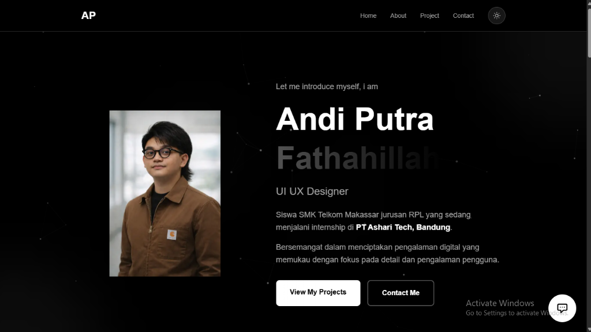

# Asharitech Portfolio

A modern, responsive portfolio website built to showcase my projects, skills, and professional journey. This application leverages the latest web technologies to provide a seamless and engaging user experience.

## 🚀 Key Features

### Portfolio
- **Modern Hero Section**: Engaging introduction with smooth animations.
- **Project Showcase**: Highlights of recent work and contributions.
- **About & Skills**: Detailed professional profile and technical stack.
- **Responsive Design**: Fully optimized for mobile, tablet, and desktop.
- **Dark/Light Mode**: Thematic styling for user preference.

### AI Document Editor
The project includes a powerful **AI Editor** powered by Google Gemini.
👉 **[View AI Editor Documentation](src/app/ai-editor/README.md)** for detailed setup, testing, and features.

---

## 🛠️ Built With

- **Next.js 15** - The React Framework for the Web
- **React 19** - JavaScript library for building user interfaces
- **TypeScript** - Typed Superset of JavaScript
- **Tailwind CSS** - Utility-first CSS framework
- **Google Generative AI** - Powering the intelligent chat widget

## 📸 Screenshots



## 📦 Setup

To get a local copy up and running, follow these steps:

1. Clone the repository
2. Install dependencies:
   ```bash
   npm install
   ```
3. Run the development server:
   ```bash
   npm run dev
   ```

## 🔗 Demo

🔗 [Live Demo](https://my-first-nextjs.vercel.app)

---

## 🏆 Code Quality Standards

This project adheres to strict development standards:

-   **TypeScript**: Full type safety with interfaces for `Message`, `Document`, and API responses.
-   **Error Handling**:
    -   API routes use `try/catch` blocks with proper status codes.
    -   UI handles loading states and displays user-friendly error messages.
-   **'use client' Directives**: Correctly applied to interactive components (`AIChat.tsx`, `DocumentEditor.tsx`).
-   **Clean Code**:
    -   No `console.log` in production code.
    -   Complex logic (e.g., search matching, usage of `useCallback`) is documented with comments.
-   **Modern React**: Utilizes React 19 hooks (`useActionState` where applicable, standard hooks otherwise) and Next.js 15 App Router.
